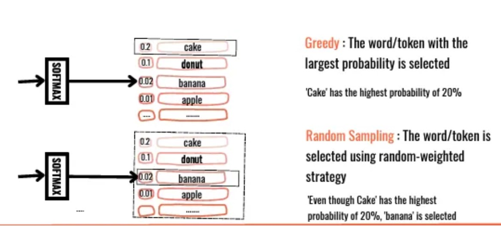
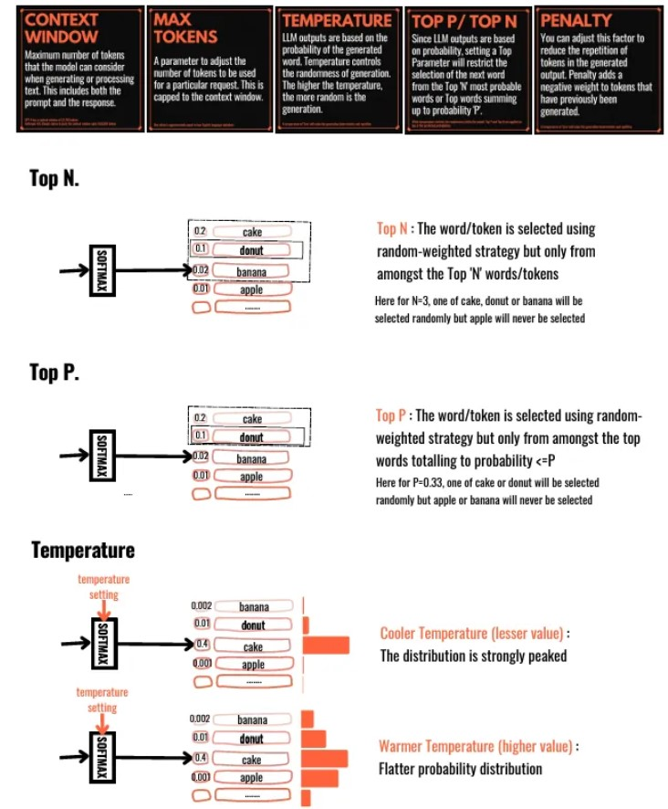
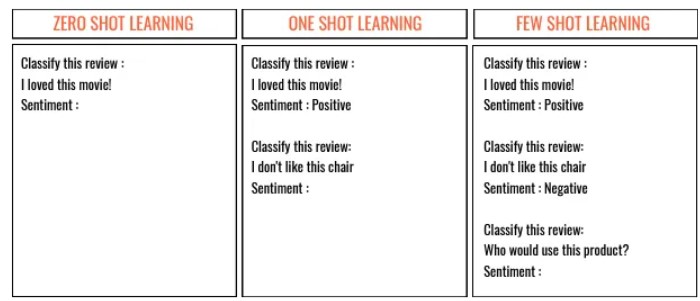
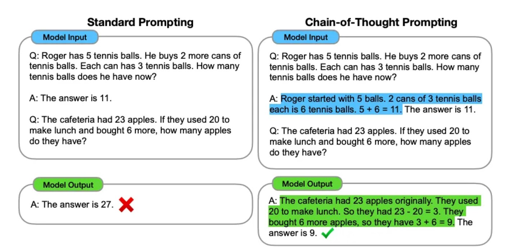
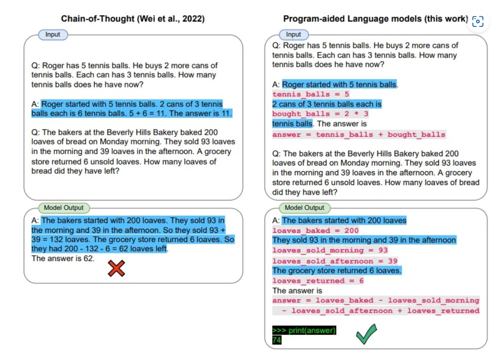
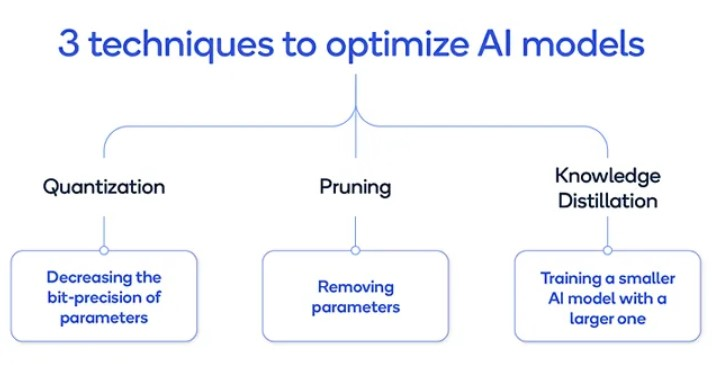
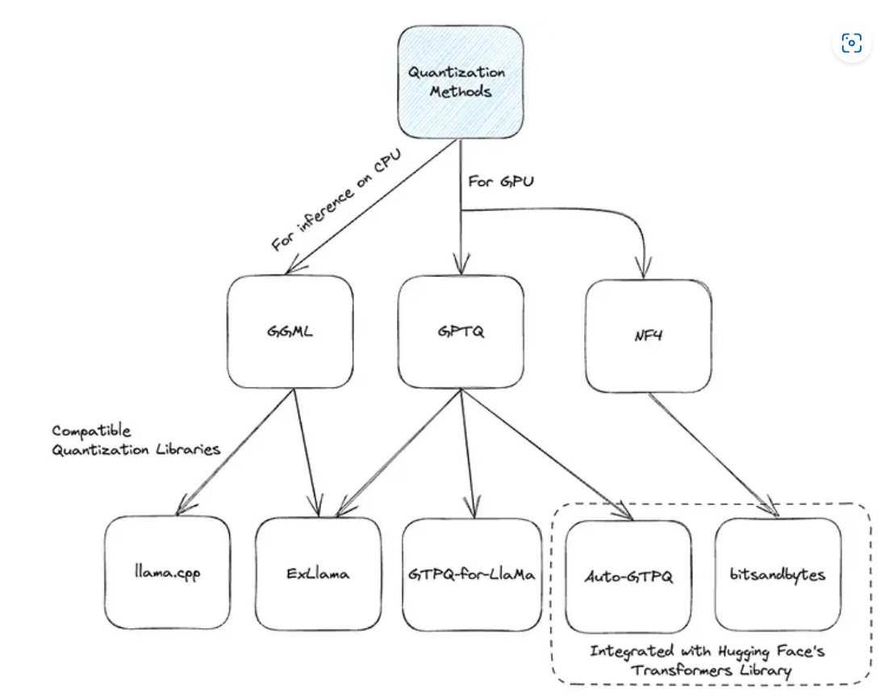
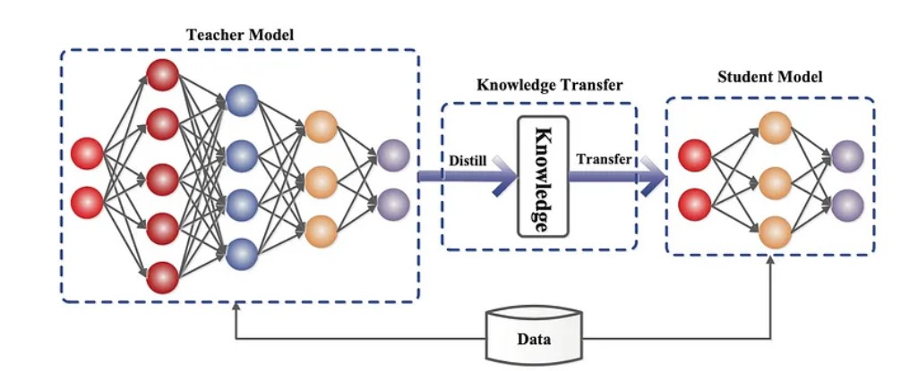

Generation part of the RAG pipeline
![[Pasted image 20240617142040.png]]

## How are LLMs Built?

- Not to scare you, just to give an idea of what all underlying things are present.
![[Pasted image 20240617142315.png]]

## Architecture of LLMs

Basically, currently there are 3 architectures for Language models:
1. Encoder Based
2. Decoder Based
3. Encoder-Decoder Based

But Most of the early LLMs were created using RNN models with LSTMs and GRUs. However, they faced challenges, mainly in performing NLP tasks at massive scales. 

RNNs can use their internal state to process variable-length sequences of inputs. An RNN **has both long-term memory and short-term memory**. There are variants of RNN like [Long-short Term Memory (LSTM)](https://en.wikipedia.org/wiki/Long_short-term_memory) and [Gated Recurrent Units (GRU)](https://en.wikipedia.org/wiki/Gated_recurrent_unit).

[Basics of RNN](https://youtu.be/Y2wfIKQyd1I?si=wJmUSEvDpk4PyHjs)

[Basics of LSTM](https://youtu.be/LfnrRPFhkuY?si=KoxCKJ8U59bGATIx)

[Basic of GRU](https://youtu.be/tOuXgORsXJ4?si=TZNIYV-zX-lzwb3g)

#### What was the problem with LSTMs and GRU?
**A RNN that uses LSTM units is very slow to train**. Moreover, we need to feed the data sequentially or serially for such architectures. This does not allow us to parallelize and use available processor cores.

Alternatively, an **RNN model with GRU trains faster but performs poorly on larger datasets**. Nevertheless, for a long time, LSTMs and GRUs remained the preferred choice for building complex NLP systems. However, such models also suffer from the vanishing gradient problem.

[Vanishing and Exploding Gradient Problem](https://youtu.be/qowp6SQ9_Oo?si=lamcHAYyVfrtrp--)

These problems were significantly solved using the Attention Mechanism (which we learned in the Attention is All you need paper).
To recap, in layman terms - Attention is a technique to enhance some parts of the input data while diminishing other parts.

Coming to the present day,
![[Pasted image 20240617144053.png]]

## Data Parallel Training Techniques

Training large language models (LLMs) like GPT-4 requires the use of **distributed computing patterns** as there is a need to work with vast amounts of data while training with LLMs having multi-billion parameters vis-a-vis limited [GPU](https://vitalflux.com/llm-gpu-memory-requirements-examples) support.
We'll see some important training patterns. The primary difference between these patterns is based on how the **model is split or sharded across GPUs in the system.

###  Distributed Data Parallel (DDP)

In the **DDP computing pattern**, **a single copy of the entire model is loaded into each GPU** in the distributed computing environment.
This means that if you have multiple GPUs, each one will contain a complete copy of the model. **Quantization** is used to load a single copy of the model in each GPU.

> **Quantization is a technique that reduces the precision of model parameters (like weights and activations) to lower bit representations, aiming to decrease memory usage and computational requirements while maintaining model performance**.

Data is split into batches, and sent into the batches to each GPU in parallel. Once loaded, the data is processed in parallel in each GPU. The LLM training is achieved in parallel with this phase.

- Post LLM training, the results from each GPU (e.g., gradients) are combined (e.g., averaged).
- each model (one per GPU) in the distributed computing environment is updated with the combined results and the process continues.

As every GPU has its own model and data, along with some other data required for training, If all of the data cannot be stored in a single GPU even after quantization, **this is where FSDP comes into play**.

### Fully Sharded Data Parallel (FSDP)
In the FSDP pattern, the model is sharded across multiple GPUs because the model is too large for a single GPU (based on DDP) even after quantization.

FSDP is motivated by this paper – [ZeRO: Memory Optimizations Toward Training Trillion Parameter Models](https://arxiv.org/pdf/1910.02054.pdf). ZeRO stands for zero redundancy optimizer. The idea of ZeRO is to reduce DDP’s data redundancy by sharding the model including its additional gradients, activations, and optimizer states across the GPUs to achieve zero redundancy in the system.

> Sharding refers to dividing the model into smaller pieces or shards. Each shard is a self-contained and smaller part of the original model. The sharding process aims to exploit parallelism effectively, allowing each shard to be processed independently across different devices or processors, resulting in faster and more efficient inference.

If you wanna read more about FSDP -> [Use official PyTorch Page](https://pytorch.org/tutorials/intermediate/FSDP_tutorial.html)

![[assets/20240618022324.png]]

## Fine-Tuning

Fine-tuning is tweaking an already-trained model for some other task. The way this works is by taking the weights of the original model and adjusting them to fit a new task.

Fine-tuning is done with the help of Transfer-Learning(it is the process of freezing the weights of the initial layers of a network and only updating the weights of the later layers.).

### PEFT(Parameter Efficient Fine-Tuning)

There are various ways of achieving Parameter efficient fine-tuning. Low Rank Parameter or LoRA & QLoRA are most widely used and effective.

[LORA](youtube.com/watch?v=Us5ZFp16PaU)

[LoRA and QLoRA](https://www.youtube.com/watch?v=t1caDsMzWBk&pp=ygUFUUxPUkE%3D)

[Fine-Tuning With QLoRA](https://www.youtube.com/watch?v=NRVaRXDoI3g)

## Prompt Tuning

Later on this

## LLM Inference

Several key parameters used in configuring large language model (LLM) inference:

### Top-k Sampling
-Samples only the top-k most likely tokens at each step

-Higher k values lead to more diverse but potentially less coherent outputs

### Temperature

-Adjusts the probability distribution over possible next tokens
-Lower temperature results in more likely but potentially repetitive text
-Higher temperature promotes diversity and less predictable outputs

### Top-P (Nucleus) Sampling

-Limits the selection of tokens to a subset of the vocabulary with cumulative probability mass up to a threshold value.
-Controls the diversity of generated output

### Maximum Length

-Sets the upper limit on the number of tokens the LLM generates
-Prevents excessively long outputs

### Context Prompting

-Uses specific context prompts to guide the model.
-Ensures that generated output is relevant and coherent within the given context.

### Repetition Penalty

-Penalizes sequences with repeated n-grams.
-Encourages diversity and originality

### Sampling

-Chooses between deterministic (greedy) and random sampling-based generation.
-Greedy mode focuses on accuracy by picking the most likely token at each step.
-Random sampling introduces randomness, promoting diversity and creativity

### Beam Search

-Maintains multiple potential sequences, expanding the most promising ones at each step.
-Aims for more coherent and accurate outputs compared to top-k sampling

## Prompt Engineering 

### Definition
Prompt Engineering, also known as In-Context Prompting, involves methods of communicating with LLMs to steer their behavior for desired outcomes without updating the model weights. This field is empirical, requiring heavy experimentation as methods can vary significantly among models.

### Key Concepts in Prompt Engineering

- What is a Prompt ?
The natural language instruction used to interact with an LLM. The construction of these prompts is known as Prompt Engineering

-Role of a Prompt
Prompts facilitate In-Context Learning, where an LLM infers and completes the instructions given.

-Context Window
This refers to the maximum number of tokens an LLM can process and infer from, which is crucial in all types of learning settings

### Types of Learning in Prompt Engineering

-Zero-Shot Learning: The LLM responds to instructions without any prior examples.
-One-Shot Learning: A single example is provided to guide the LLM’s response.
-Few-Shot Learning: More than one example is provided to assist the LLM

### Advanced Prompting Techniques

#### Chain-of-Thought (CoT) Prompting
Generates a sequence of reasoning steps or rationales to lead to a final answer. Particularly beneficial for complex reasoning tasks in larger models

#### PAL (Program-Aided Language Models) 
Uses LLMs to read problems and generate programs as intermediate reasoning steps, utilizing a programmatic runtime (e.g., Python interpreter) for solutions

#### ReAct Prompting
Combines reasoning and acting, allowing LLMs to generate reasoning traces and actions for dynamic reasoning. It enables interaction with external environments to incorporate additional information into the reasoning.

## Model Optimization Techniques

Model quantization is a method used to shrink the size of big neural networks, like large language models, by changing the accuracy of their weight measurements. Essentially, while training and running these networks usually requires high accuracy, it's often possible to use lower accuracy (like float16) instead. This makes the models smaller, so they can run on less powerful devices with a small drop in how well they perform

Quantization is a technique used to reduce the size and increase the efficiency of machine learning models by decreasing the number of bits used to represent each weight in the model. This is particularly useful for deploying large language models (LLMs) on less powerful hardware or for reducing operational costs. Here's a breakdown of key concepts and strategies related to model quantization:

#### Understanding Model Quantization

why Quantize?
Reduced Model Size:Quantization lowers the number of bits required per weight from, say, 16 bits (FP16) to 4 bits (INT4). This significantly decreases the model's memory requirements.
Increased Speed: Smaller models are faster to execute because they require less computational power and memory bandwidth.
Cost Efficiency: Running smaller models can be done on less expensive or fewer hardware resources.

Impact on Model Performance:
Although quantization reduces the size, it can also slightly degrade the model's accuracy. However, the extent of this impact varies. For very large models (e.g., over 70 billion parameters), the performance drop can be negligible with the right quantization techniques.

#### Techniques of Quantization

- Post-Training Quantization (PTQ):
This technique converts an already-trained model to a lower precision format without retraining. It's simple to implement but may slightly reduce the model's accuracy due to the reduced precision of the weights.

Quantization-Aware Training (QAT):
-Unlike PTQ, QAT incorporates quantization during the training process. This method often yields better model performance because it adjusts the training to account for lower precision weights, albeit at a higher computational cost.

#### Techniques and Libraries
-GPTQ: Targets GPU execution, available in several implementations like AutoGPTQ and ExLlama.
-NF4: Works with the bitsandbytes library and is primarily used in conjunction with QLoRA methods.
-GGML: A C library that interfaces well with the llama.cpp library, designed for efficient loading and performance.

### Knowledge Distillation

Knowledge Distillation is a method where a small, less complex model (called the "student model") learns to perform tasks quickly by copying from a larger, more complex model (called the "teacher model") that has already been trained. The idea is to make the student model fast and efficient. The design of the student model can be quite flexible, but it should have the same type of outputs as the teacher model so that it can learn effectively

The teacher model is already well-adjusted to the training data, so its predictions are very close to the actual data and don't vary much.

When the temperature is greater than 1, the probability distribution expands. This means:
- If T > 1, the teacher model's outputs are smoother, called soft labels, and the student model also produces smoother, soft predictions
- If  T = 1 , both the teacher and student models give more definite, sharp outputs, known as hard labels and hard predictions

Knowledge distillation isn't very effective for models that generate text, like decoder models. It works better for models that are only encoders, such as BERT, because these models often have redundant ways of representing information

### Pruning 

Network pruning reduces the size of a model by trimming unimportant weights or connections, while aiming to preserve the model's capacity. This process may be executed with or without re-training the network

[Pruning](https://youtu.be/UcwDgsMgTu4?si=3RsApZhQDT6Z8h8-&t=359)

